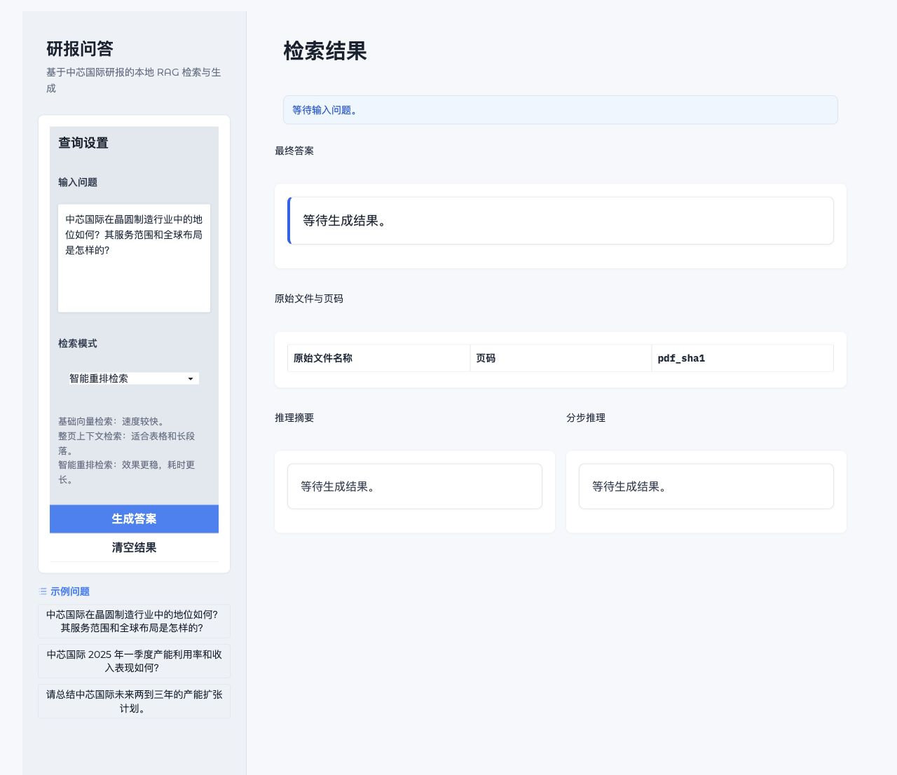

# RAG 知识库问答系统

这是一个面向中芯国际研报的本地 RAG 问答项目。项目把 PDF 研报解析为 Markdown 和结构化分块，使用 DashScope `text-embedding-v4` 生成向量，使用 LangChain FAISS 与 LangChain BM25 做混合检索，并通过 Qwen 模型生成带引用页码的结构化答案。

项目适合用来学习或演示一个完整的中文金融研报 RAG 流程：PDF 解析、文本分块、向量入库、混合检索、LLM 重排、结构化回答和 Gradio 页面展示。

## 功能概览

- PDF 本地解析：使用 MinerU 将 PDF 研报解析为 Markdown 和 `content_list.json`。
- 文档分块：优先使用 MinerU 的 `page_idx` 保留真实页码，再用 LangChain `RecursiveCharacterTextSplitter` 在页内分块。
- 向量检索：使用 DashScope `text-embedding-v4` 生成 embedding，并通过 LangChain FAISS 保存和检索。
- BM25 检索：使用 LangChain `BM25Retriever` 补充关键词、数字、表格指标和专有名词召回。
- 混合召回：智能重排模式会合并 FAISS 向量检索和 BM25 检索结果，并去重。
- LLM 重排：使用 Qwen 对候选上下文重新打分排序。
- 结构化回答：使用 Pydantic 校验 Qwen 输出，返回最终答案、推理摘要、分步分析和引用页码。
- Gradio 前端：提供本地 Web 页面，支持选择不同检索模式并展示答案来源。
- CLI 工具：提供 PDF 解析、报告处理、批量问答和单问题问答命令。

## 技术栈

| 模块 | 技术 |
| --- | --- |
| PDF 解析 | MinerU 本地解析 |
| 文本分块 | LangChain `RecursiveCharacterTextSplitter` |
| Embedding | DashScope `text-embedding-v4` |
| 向量库 | LangChain FAISS |
| 词面检索 | LangChain `BM25Retriever` + `rank-bm25` |
| 生成模型 | DashScope Qwen |
| 结构化输出 | Pydantic |
| 前端 | Gradio |
| 命令行 | Click |

## 处理流程

```text
PDF 研报
-> MinerU 本地解析
-> Markdown + content_list.json
-> 按页聚合并用 LangChain 分块
-> DashScope embedding
-> LangChain FAISS 向量库
-> 用户问题
-> 向量召回 + BM25 召回
-> 合并去重
-> Qwen LLMReranker 重排
-> Qwen 生成结构化答案
-> 返回答案、推理过程、引用文件和页码
```

## 目录结构

```text
rag_stock_qwen/
├── app_gradio.py               # Gradio 前端入口
├── main.py                     # Click 命令行入口
├── requirements.txt            # Python 依赖
├── run_python.sh               # macOS Python 3.13.12 运行脚本
├── setup.py                    # 包配置
├── README.md
├── .env.example                # DashScope Key 示例
├── src/
│   ├── pipeline.py             # 主流程编排和配置
│   ├── pdf_mineru.py           # MinerU PDF 解析封装
│   ├── text_splitter.py        # 文档分块
│   ├── ingestion.py            # DashScope Embeddings 与 FAISS 入库
│   ├── retrieval.py            # 向量检索、BM25 检索和混合检索
│   ├── reranking.py            # LLM 重排
│   ├── api_requests.py         # DashScope Qwen 调用与结构化输出
│   ├── prompts.py              # 问答和重排提示词
│   └── questions_processing.py # 问题处理、引用校验和答案格式化
└── data/stock_data/
    ├── pdf_reports/            # 原始 PDF 文件
    ├── subset.csv              # PDF、公司名和 sha1 映射
    ├── questions.json          # 批量问题样例
    ├── debug_data/
    │   └── 03_reports_markdown/ # MinerU 解析后的 Markdown 和 content_list
    └── databases/
        ├── chunked_reports/    # 分块 JSON
        └── vector_dbs/         # LangChain FAISS 索引目录
```

当前项目已内置 9 份中芯国际相关研报 PDF，以及对应的 Markdown、分块 JSON 和 LangChain FAISS 索引。默认 PDF 来源是项目内：

```text
data/stock_data/pdf_reports/
```

## 环境准备

本项目在 macOS 上开发，项目 Python 版本为 `3.13.12`。建议使用项目自带脚本运行：

```bash
cd /Users/cjz/Desktop/实战项目/RAG/rag_stock_qwen
./run_python.sh --version
```

安装依赖：

```bash
./run_python.sh -m pip install -r requirements.txt
```

复制环境变量示例：

```bash
cp .env.example .env
```

在 `.env` 中填写 DashScope Key：

```bash
DASHSCOPE_API_KEY=你的DashScope API Key
```

也可以在当前 shell 中临时设置：

```bash
export DASHSCOPE_API_KEY=你的DashScope API Key
```

说明：

- MinerU 当前使用本地解析模式，不需要 MinerU 云端 token。
- DashScope Key 用于 embedding、Qwen 回答和 LLM 重排。
- 只打开 Gradio 页面不需要立刻调用模型；点击生成答案时才会访问 DashScope。

## 快速开始

如果你只想直接体验已经处理好的数据，可以跳过 PDF 解析和索引生成，直接启动前端：

```bash
cd /Users/cjz/Desktop/实战项目/RAG/rag_stock_qwen
./run_python.sh app_gradio.py
```

启动后访问终端输出的本地地址，例如：

```text
http://127.0.0.1:7860
```

如果默认端口被占用，可以指定端口：

```bash
GRADIO_SERVER_PORT=64885 ./run_python.sh app_gradio.py
```

页面支持：

- 输入中文研报问题
- 选择检索模式
- 查看最终答案
- 查看推理摘要和分步推理
- 查看引用的原始 PDF 文件名和页码

运行界面示例：



## 命令行用法

查看全部命令：

```bash
./run_python.sh main.py --help
```

### 1. 准备 MinerU 资源

```bash
./run_python.sh main.py prepare-mineru-resources
```

当前 MinerU 会在本地准备所需资源。首次运行解析 PDF 时也可能自动准备资源。

### 2. 解析 PDF

并行解析全部 PDF：

```bash
./run_python.sh main.py parse-pdfs --parallel --chunk-size 2 --max-workers 4
```

顺序解析全部 PDF：

```bash
./run_python.sh main.py parse-pdfs --sequential
```

解析结果会写入：

```text
data/stock_data/debug_data/03_reports_markdown/
```

每份 PDF 通常会生成：

- `.md`：Markdown 文本
- `_content_list.json`：MinerU 的结构化解析结果，包含 `page_idx`

### 3. 生成分块和向量索引

```bash
./run_python.sh main.py process-reports
```

这个命令会执行：

```text
Markdown/content_list
-> chunked_reports/*.json
-> DashScope embedding
-> vector_dbs/<pdf_sha1>/index.faiss
-> vector_dbs/<pdf_sha1>/index.pkl
```

生成后的 LangChain FAISS 索引目录示例：

```text
data/stock_data/databases/vector_dbs/<pdf_sha1>/index.faiss
data/stock_data/databases/vector_dbs/<pdf_sha1>/index.pkl
```

BM25 不需要单独生成索引文件。检索时会基于 `data/stock_data/databases/chunked_reports/` 中的分块 JSON 动态构建 BM25 检索器。

### 4. 单问题问答

默认使用 `max` 智能重排模式：

```bash
./run_python.sh main.py ask "中芯国际在晶圆制造行业中的地位如何？其服务范围和全球布局是怎样的？"
```

输出完整 JSON：

```bash
./run_python.sh main.py ask "中芯国际 2025 年一季度产能利用率和收入表现如何？" --json-output
```

指定检索模式：

```bash
./run_python.sh main.py ask "中芯国际的产能利用率如何？" --config base
./run_python.sh main.py ask "中芯国际的产能利用率如何？" --config pdr
./run_python.sh main.py ask "中芯国际的产能利用率如何？" --config max
```

### 5. 批量问题处理

批量处理会读取：

```text
data/stock_data/questions.json
```

运行：

```bash
./run_python.sh main.py process-questions --config max
```

输出文件会写入 `data/stock_data/answers*.json`，这类运行结果默认不会提交到 git。

## 检索模式说明

`main.py` 和 Gradio 页面共用 `src/pipeline.py` 中的配置。

| 页面名称 | CLI 配置 | 检索逻辑 | 适用场景 |
| --- | --- | --- | --- |
| 基础向量检索 | `base` | LangChain FAISS 向量检索 | 速度较快，适合简单事实查询 |
| 整页上下文检索 | `pdr` | FAISS 向量检索 + 返回整页文本 | 适合需要表格上下文或完整段落的问题 |
| 智能重排检索 | `max` | FAISS 向量召回 + BM25 召回 + 合并去重 + LLM 重排 | 质量更稳，适合正式问答 |

推荐默认使用 `max`。

混合检索细节：

```text
用户问题
-> DashScope embedding
-> LangChain FAISS 召回语义相近片段
-> LangChain BM25 召回关键词、数字、专有名词相关片段
-> 按 pdf_sha1、页码、文本去重合并
-> Qwen 对候选片段重新评分
-> 取 top_n 作为 RAG 上下文
```

BM25 对以下问题尤其有帮助：

- 问题包含年份、季度、百分比、价格、节点等精确词。
- 问题包含研报标题、机构名、产品线、工艺节点等专有名词。
- 原文和问题有明显关键词重合，但向量相似度不一定排在最前。

## 数据更新流程

如果要新增或替换 PDF：

1. 把 PDF 放到：

```text
data/stock_data/pdf_reports/
```

2. 如果已有 `subset.csv` 不包含新文件，需要更新或删除后让程序重新生成。当前默认公司名统一写为 `中芯国际`。

3. 重新解析 PDF：

```bash
./run_python.sh main.py parse-pdfs --parallel --chunk-size 2 --max-workers 4
```

4. 重新生成分块和 FAISS 索引：

```bash
./run_python.sh main.py process-reports
```

5. 启动前端或运行问答：

```bash
./run_python.sh app_gradio.py
```

## 关键实现说明

### MinerU 本地解析

`src/pdf_mineru.py` 封装 MinerU PDF 解析。当前模式是本地解析，所以不需要 MinerU 云端 token。解析结果保存在 `debug_data/03_reports_markdown/`。

### 分块与页码

`src/text_splitter.py` 优先读取 MinerU 的 `_content_list.json`，按 `page_idx` 聚合页面内容，再在单页内使用 LangChain `RecursiveCharacterTextSplitter` 分块。这样可以在检索和回答中保留真实 PDF 页码。

### 向量库

`src/ingestion.py` 中的 `DashScopeEmbeddings` 适配 LangChain `Embeddings` 接口。`VectorDBIngestor` 使用 LangChain FAISS 保存每份报告的向量库：

```text
vector_dbs/<pdf_sha1>/index.faiss
vector_dbs/<pdf_sha1>/index.pkl
```

### 混合检索

`src/retrieval.py` 中包含：

- `VectorRetriever`：读取 LangChain FAISS 索引做向量检索。
- `BM25ReportRetriever`：基于分块 JSON 创建 LangChain BM25 检索器。
- `HybridRetriever`：合并向量召回和 BM25 召回，再交给 LLM 重排。

### 结构化输出

`src/api_requests.py` 调用 DashScope Qwen，并使用 Pydantic 校验结构化 JSON 输出。提示词和输出 schema 在 `src/prompts.py` 中定义。

## 常见问题

### 1. 为什么 MinerU 不需要 token？

当前项目使用 MinerU 本地解析模式，不调用 MinerU 云端 API，因此不需要 MinerU token。DashScope Key 只用于 embedding、Qwen 回答和 LLM 重排。

### 2. 为什么生成答案时必须联网？

生成答案需要调用 DashScope：

- `text-embedding-v4`：把用户问题转成向量。
- Qwen：生成最终答案。
- Qwen：在智能重排模式下给候选片段打分。

### 3. 已经有索引了，还需要重新运行 `process-reports` 吗？

如果 PDF、Markdown、分块逻辑或 embedding 模型没有变化，可以不重新运行。如果新增 PDF、替换 PDF 或修改了分块/向量化逻辑，需要重新运行。

### 4. `base`、`pdr`、`max` 应该怎么选？

- 调试速度优先：用 `base`。
- 需要完整页上下文：用 `pdr`。
- 正式问答质量优先：用 `max`。

### 5. `.env` 会不会被提交？

不会。`.gitignore` 已排除 `.env`、缓存文件、运行答案和旧的单文件 FAISS 索引。

## 注意事项

- 本项目默认数据集是中芯国际相关研报，`subset.csv` 中的公司名也按这个场景组织。
- PDF 和向量索引已放入项目目录，便于克隆后直接体验。
- Gradio 页面不会自动重新解析 PDF 或重新生成索引。
- 批量处理问题时会产生答案 JSON，默认不提交到 git。
- 如果仓库公开，请确认 PDF 研报和生成索引是否允许公开分发。
